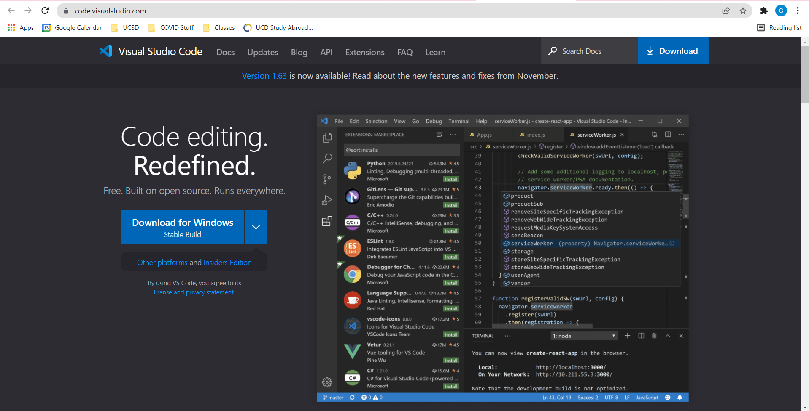
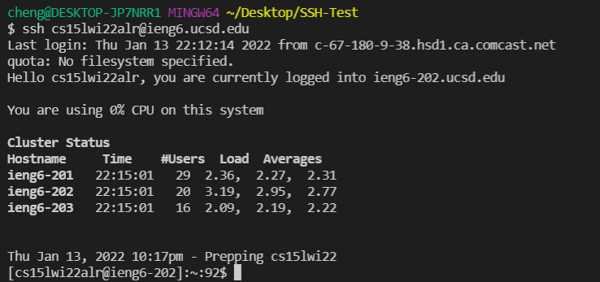
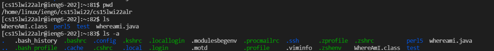
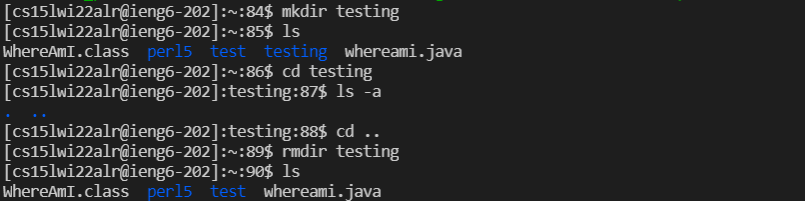

# Lab Report 1 - Week 2

Greetings, incoming student of CSE 15L. In this article, you'll learn how to log into the login to your course-specific account via the terminal.

## Installing VSCode

Before doing anything, the first thing you need to do is to install Visual Studio Code (VSCode). VSCode is a popular code editer that includes a variety of features from easy access to a terminal to autocompleting code that you type. On top of that, it's extremely easy to install!

Installing VSCode is as simple as visiting https://code.visualstudio.com/ and click the download button.



Once you have installed everything and launched VSCode, you're ready to begin coding and connecting to your course specific account.

Before everything, I recommend opening up a new folder and naming it something like `Labs` or `SSH Testing` or whatever name is intuitive to you. This will be the folder where you will have all of your remote connection related stuff with, and it makes it better for organization. In order to do this, you can create a new folder on your Desktop, name it how you like, and open the folder on VSCode by going to `Files > Open Folder...` and selecting the folder you just made. Alternatively, you can use the keyboard shortcut `Ctrl` + `K` + `O` to open a folder as well. Once you have opened your folder, you should be in a workspace that is ready for you to work in.

Finally, before actually remotely connecting, you will need to open a new terminal to run commands in. This can be found in `Terminal > New Terminal` or the keyboard shortcut `Ctrl` + `Shift` + `````. Now you are ready!

## Remotely Connecting

In order to remotely connect, in the terminal you just pulled up, type the following. Do not type the dollar sign -- that's just an indication that the following is a console command. Also make sure that you replace the `aa` in `cs15lwi22aa` with the actual letter code that you were given for the course.

```
$ ssh cs15lwi22aa@ieng6.ucsd.edu
```

If you have set up your SSH keys before, this should automatically log you in. If not, we'll cover that in a bit. For now, you need to type your password. Don't worry if you copy/paste or type your password but don't see anything: that's part of the terminal's security features. If you typed in your password correctly and hit enter, you should see something along the lines of the following:



If you see this, you have connected. Nice!

## Trying Some Commands

Now that you have full access to this remote server, you can mess around as you like. Let's test some commands!

- `pwd`: Prints your working directory.
- `ls`: Lets you see what files and folders are currently in the directory you are in.
- `ls -a`: Prints *all* of the files and directories in the working directory, including any hidden files.



- `mkdir`: Creates a directory. Add a name after `mkdir` that you wish to name your new directory.
- `cd`: Navigates you to a directory. Add the name of a directory after `cd` that you wish to navigate to in the current directory.
- `cd ..`: Navigates you back one level in the directory.
- `rmdir`: Removes a directory. Add the name of the directory you want to delete after `rmdir` to remove that directory.

