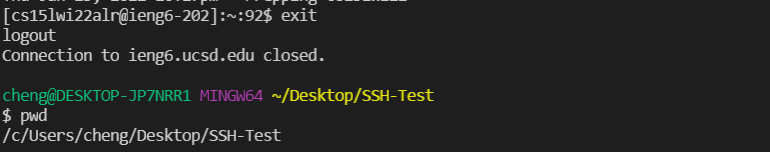
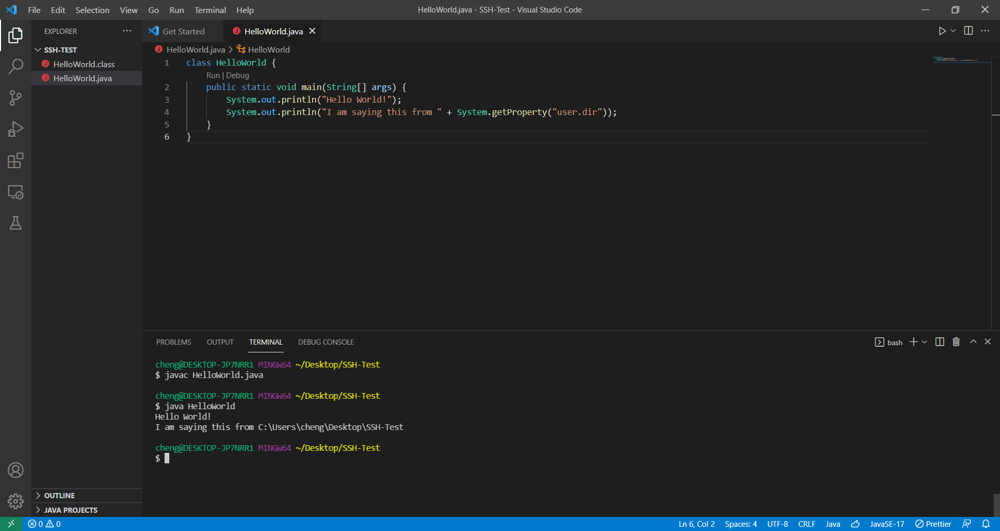
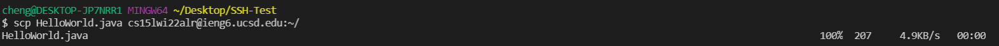
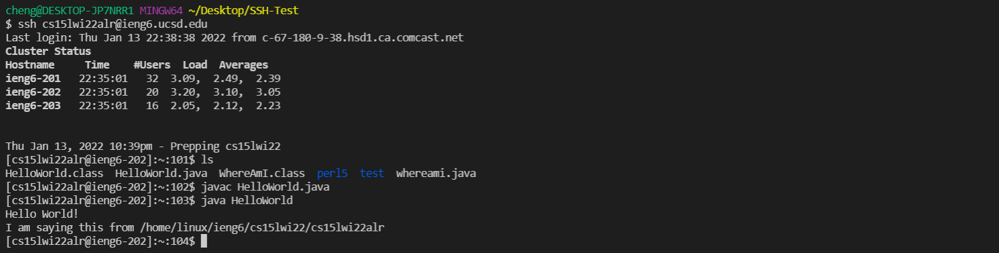
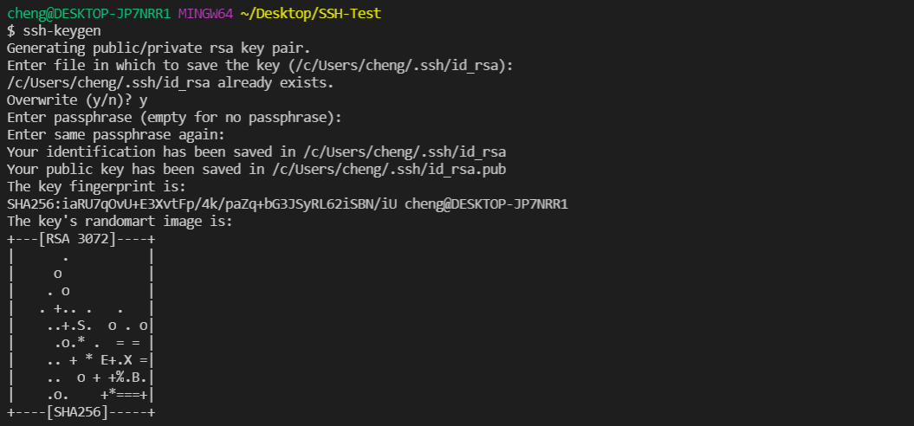
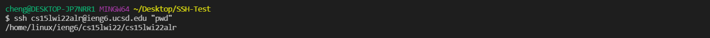
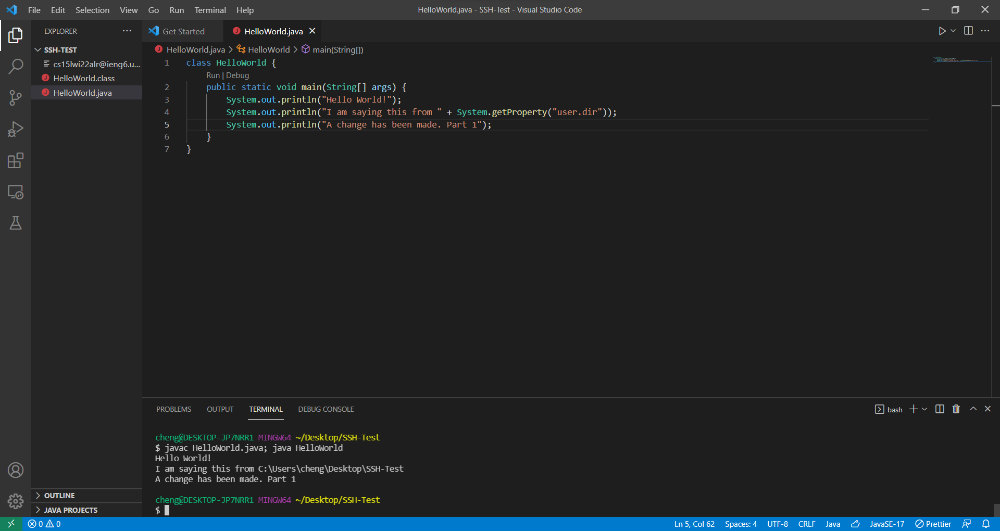
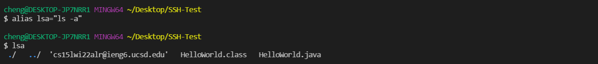
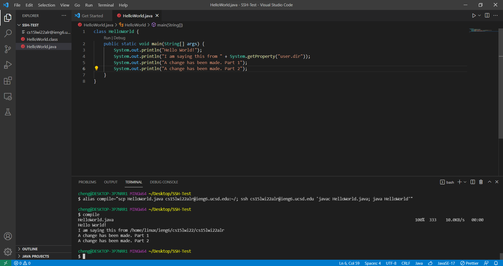

# Lab Report 1 - Week 2

Greetings, incoming student of CSE 15L. In this article, you'll learn how to log into the login to your course-specific account via the terminal.

## Installing VSCode

Before doing anything, the first thing you need to do is to install Visual Studio Code (VSCode). VSCode is a popular code editer that includes a variety of features from easy access to a terminal to autocompleting code that you type. On top of that, it's extremely easy to install!

Installing VSCode is as simple as visiting https://code.visualstudio.com/ and click the download button.


Once you have installed everything and launched VSCode, you're ready to begin coding and connecting to your course specific account.

Before everything, I recommend opening up a new folder and naming it something like `Labs` or `SSH Testing` or whatever name is intuitive to you. This will be the folder where you will have all of your remote connection related stuff with, and it makes it better for organization. In order to do this, you can create a new folder on your Desktop, name it how you like, and open the folder on VSCode by going to `Files > Open Folder...` and selecting the folder you just made. Alternatively, you can use the keyboard shortcut `Ctrl` + `K` + `O` to open a folder as well. Once you have opened your folder, you should be in a workspace that is ready for you to work in.

Finally, before actually remotely connecting, you will need to open a new terminal to run commands in. This can be found in `Terminal > New Terminal` or the keyboard shortcut `Ctrl` + `Shift` + `` ` ``. Now you are ready!

## Remotely Connecting

In order to remotely connect, in the terminal you just pulled up, type the following. Do not type the dollar sign -- that's just an indication that the following is a console command. Also make sure that you replace the `aa` in `cs15lwi22aa` with the actual letter code that you were given for the course.

```
$ ssh cs15lwi22aa@ieng6.ucsd.edu
```

If you have set up your SSH keys before, this should automatically log you in. If not, we'll cover that in a bit. For now, you need to type your password. Don't worry if you copy/paste or type your password but don't see anything: that's part of the terminal's security features. If you typed in your password correctly and hit enter, you should see something along the lines of the following:


If you see this, you have connected. Nice!

## Trying Some Commands

Now that you have full access to this remote server, you can mess around as you like. Let's test some commands!

- `pwd`: Prints your working directory.
- `ls`: Lets you see what files and folders are currently in the directory you are in.
- `ls -a`: Prints *all* of the files and directories in the working directory, including any hidden files.


- `mkdir`: Creates a directory. Add a name after `mkdir` that you wish to name your new directory.
- `cd`: Navigates you to a directory. Add the name of a directory after `cd` that you wish to navigate to in the current directory.
- `cd ..`: Navigates you back one level in the directory.
- `rmdir`: Removes a directory. Add the name of the directory you want to delete after `rmdir` to remove that directory.


Now you know some basic commands! You can always find more by looking it up. The internet is very convenient these days.

## Moving Files with `scp`

One *extremely* useful command is `scp`. `scp` stands for Secure Copy Protocol, and is essentially an easy way to copy files from your computer onto the server.

In order to test this out, let's first exit our connection to the server with `exit`. This should take you back to your local machine. You can check to make sure it's your computer by typing `pwd` and making sure the directory looks correct.



Before we copy a file over, we need to create a file first. In the folder we are currently in, let's go ahead and create a java file called `HelloWorld.java`. Add the following code into the file:

```java
class HelloWorld {
    public static void main(String[] args) {
        System.out.println("Hello World!");
        System.out.println("I am saying this from " + System.getProperty("user.dir"));
    }
}
```

Just to make sure the code works, let's run `javac HelloWorld.java` and `java HelloWorld`.



Now, let's the copy the file over to the server.

```
$ scp HelloWorld.java cs15lwi22aa@ieng6.ucsd.edu:~/
```

Once again, if you have your keys set up, you should be done there. If not, just type your password and it should be good to go.



If you login to the server once more, typing `ls` will show you that the file is indeed in your directory. Once again, compile and run the java code with `javac HelloWorld.java` and `java HelloWorld`. You should see your code running.



You're ready for the next step.

## Setting an SSH Key

Are you sicked and tired of typing your password over and over and over again? Do you ever wish that you could just *not* type your password? Then SSH Keys are the perfect fit for you! Get yours now for a low price of $0.

Start by exiting back to your local machine. Type the following.

```
$ ssh-keygen
```

When it asks you for a file in which to save the key, press enter to use the default file. Press enter again when it asks you for the passphrase if you don't want to have one. It should look something like this except for the `Overwrite (y/n)?` part, since I've already set this up before.



Once you do that, log back into the server. Create a `.ssh` directory with `mkdir .ssh`. Once you do that log back out and return to your local machine.

Now, type `$ scp FILENAME SOMETHING@ieng6.ucsd.edu:~/.ssh/authorized_keys`, where `FILENAME` is replaced with whatever file you saved the key in along with a `.pub` extension and `SOMETHING` is your `cs15lwi22` with your letter code. For me, it should look like the following:

```
$ scp /c/Users/cheng/.ssh/id_rsa.pub cs15lwi22alr@ieng6.ucsd.edu:~/.ssh/authorized_keys
```

Once you've entered your password one last time, you should be able to login now. You can test by calling the `ssh` command once again. If it doesn't ask for a password, you've succeeded. Note that `scp` now also doesn't require a password.

## Optimizing Remote Running

Now to make your remote experience faster than ever. Just as cyclists believe in the word "aerodynamics" to a cult-like degree, you should intensely focus on "efficiency".

Some things worth noting.

- You can log onto the server, run a command, and immediately log back out with the `ssh` command by doing the following.
```
$ ssh cs15lwi@ieng6.ucsd.edu "pwd"
```


- You can run multiple commands in one line by using semicolons. Try adding a `System.out.println()` statement to your HelloWorld.java code and run this.
```
$ javac HelloWorld.java; java HelloWorld
```


- You can use the `alias` command to make shortcut commands in the terminal.
```
$ alias lsa="ls -a"
$ lsa
```


All together, you can do something like this.

```
$ alias compile="scp HelloWorld.java cs15lwi22alr@ieng6.ucsd.edu:~/; ssh cs15lwi22alr@ieng6.ucsd.edu 'javac HelloWorld.java; java HelloWorld'"
```

Now, whenever you use the custom command `compile`, you will copy the HelloWorld.java file from your local machine to the server, compile it, run it, and log back out of the server.



- You can also press the up arrow key in the terminal to go to previous commands, which is more practical but less epic than using alias.

## Conclusion

That was it for Lab Report 1. Hopefully I can come back to this in the future and reference it, because I know I'll probably forget how to do some of this stuff.