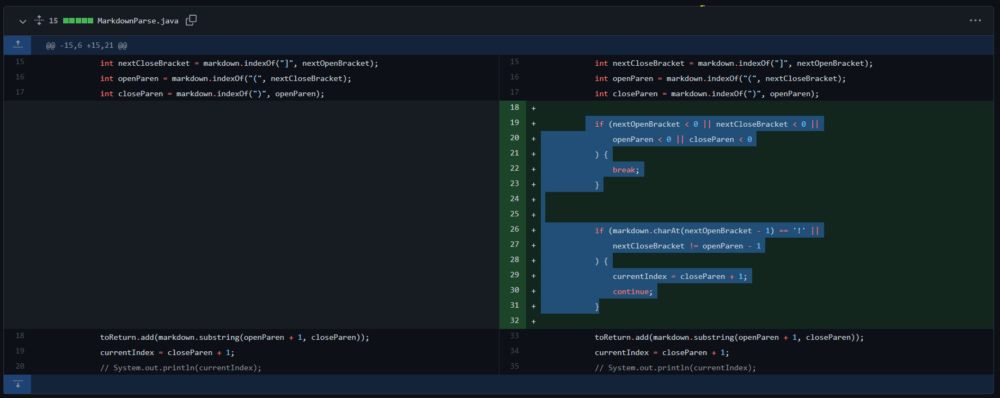
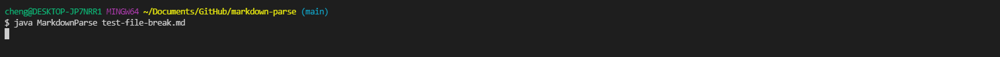
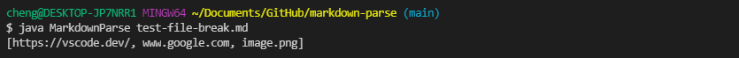
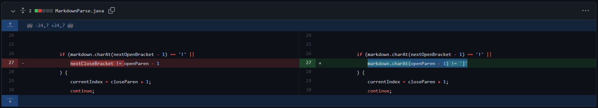
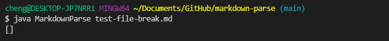
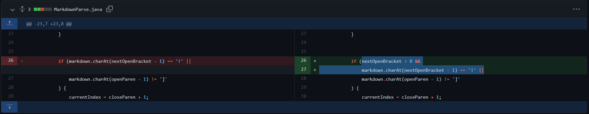
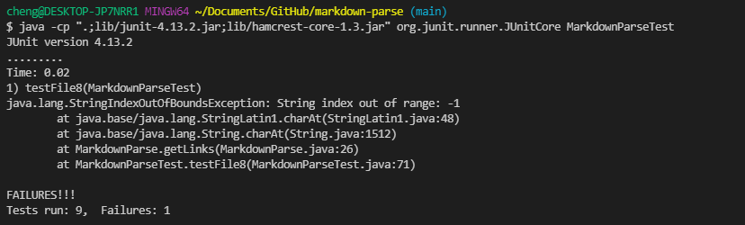

# Lab Report 2 - Week 4

This week's lab reports explores the various bugs found with the MarkdownParse.java file during labs and the process of fixing those bugs.

## Commit #1

The first commit actually fixed three things at once (since I forgot to push the commit in between each fix). Here, however, I split them  into two sets of failure-inducing input and symptoms.

Here is the link to the file that caused the [first failure-inducing input](https://github.com/CatFish47/markdown-parse/blob/main/breaks-first-commit-1.md). The symptoms are shown in the image below.

The symptom seemed to be that when the program was ran on the failure-inducing input, the terminal simply stopped responding to any command until I pressed `Ctrl` + `C`. What I could assume from this sympton, therefore, was that there was an infinite loop somewhere that prevented the program from ever stopping. This input was intentionally made to not have any opening nor closing brackets, so upon further inspection into the code, it seemed as if the bug was that the code would continue running even if it could not find an open square bracket. 

Here is the [second failure-inducing input](https://github.com/CatFish47/markdown-parse/blob/main/breaks-first-commit-2.md). The symptoms are once again below.

This time, there were two things that the failure-inducing input was attempting to test. The first was what would happen if there was anything between the end square bracket and the starting paranthesis. The second was what if there was an image in the file. Since neither of these should have translated into links, the fact that MarkdownParser.java displayed the two as links was a symptom. The bug, therefore, was that there were no checks implemented to make sure that neither case could be interpreted as a link.

## Commit #2

The second commit was prompted by [this problematic file](https://github.com/CatFish47/markdown-parse/blob/main/breaks-second-commit.md), with the symptoms shown below.

This time, the failure-inducing input included a file with brackets inside brackets. While this would normally be a link, the output of running MarkdownParse resulted in an empty list, indicating that no links were found and therefore the symptom. The bug ended up being a result of a previous modification to the code that resolved the bug where the program would think that any set of brackets followed by any set of parantheses would result in a link, regardless of if there was something separating the `]` and the `(`.

## Commit #3

Here is another [link to the problematic file](https://github.com/CatFish47/markdown-parse/blob/main/breaks-third-commit.md).

The failure-inducing input was a file where the link was on the very first line. The symptom was found using JUnit, where an error was thrown with the message `java.lang.StringIndexOutOfBoundsException: String index out of range: -1`. The bug was that in checking for if the link was a link or an image, the program accidentally tried to check the index -1 for an exclamation mark, throwing an error.