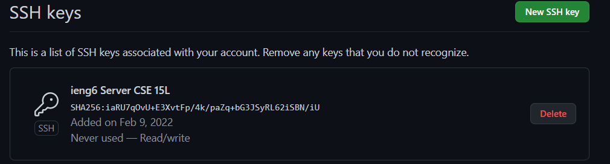
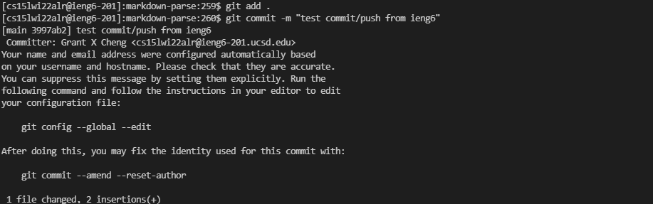
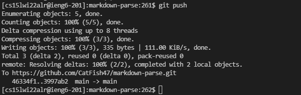

# Lab Report 3 - Week 6

This lab report, we're going to be adding an ssh key from our ieng6 account to GitHub so that we can commit and push changes to a repo from ieng6.

## The Key on GitHub

The first step in the process is to generate a key on the ieng6 server. This can be done by looking at [lab report 1](lab-report-1-week-2.md). It's also as simple as using the `ssh-keygen` command in the prompt on your ieng6 account and going through the generation process. Once a public key has been obtained, I added it to the list of ssh keys associated with my GitHub account, which can be found in the GitHub user settings under `Access -> SSH and GPG keys`.

## The Key on User Account

On ieng6, the keys are located in the .ssh file in the home directory. You can view the directory from anywhere by using `ls ~/.ssh`, such as in the screenshot below. There, you should be able to find your keys. In order to view the contents of the file, you can output the contents of the file into the console by typing `cat ~/.ssh/FILE_NAME`, where `FILE_NAME` would be the name of the public key file, such as `id_rsa.pub` in my case.

## Adding and Committing Changes

Once that is done, it should be possible to make any changes on any repo on ieng6 and git commit and push them. As an example from below, I've edited the MarkdownParse.java file by adding in a random comment in the file, creating a new change. To add all changes, the command `git add .` is used. To commit the added changes with a message, the command `git commit -m "message here"` is used. Below is a screenshot of me adding the changes and committing them, as well as the result of running the commands.

## Pushing the Changes

After committing, it should be possible to `git push` to push all commits. While normally, this would cause some form of an error, now that the keys authorize this ieng6 account to push changes to my GitHub repositories, there shouldn't be any errors.

## Conclusion

And done! The process is really simple and doesn't take that much time to set up at all. To show that all of that worked, the link to the final commit can be found [here](https://github.com/CatFish47/markdown-parse/commit/3997ab23bb0ee493b83f371e0084064a7ae75a93).