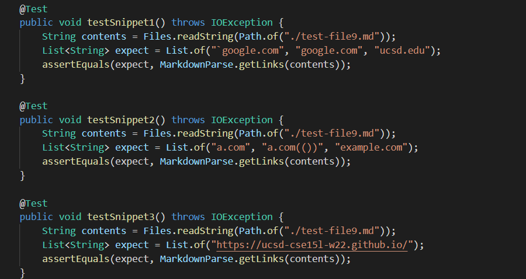
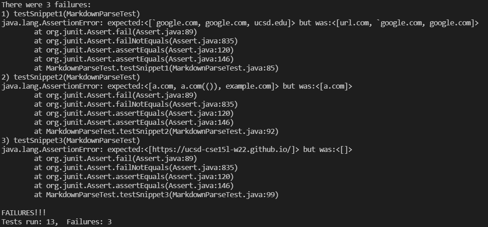
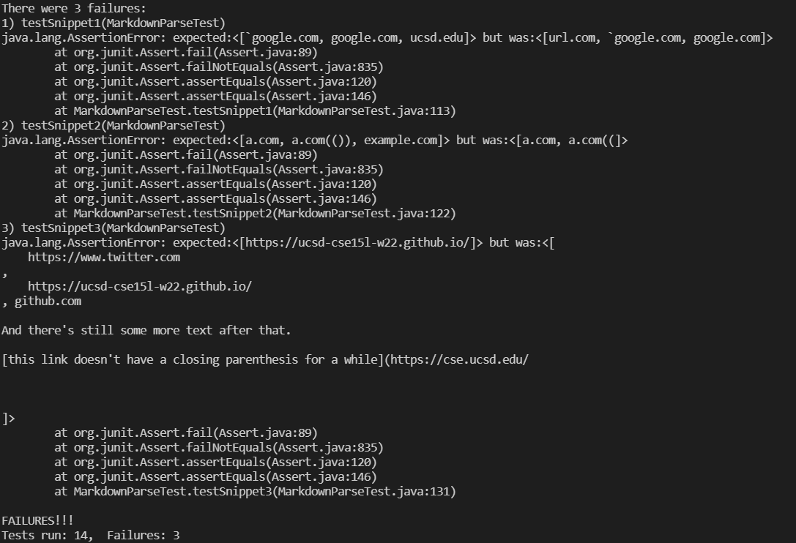

# Lab Report 4 - Week 8

Today we explore [our MarkdownParse repository](https://github.com/CatFish47/markdown-parse) and [someone else's MarkdownParse repository](https://github.com/annakkin/markdown-parse).

## The Markdown Files in Question

We will be using a few cases that will most likely break the `MarkdownParse.java` file.

Snippet 1:
```
`[a link`](url.com)

[another link](`google.com)`

[`cod[e`](google.com)

[`code]`](ucsd.edu)
```

Snippet 2:
```
[a [nested link](a.com)](b.com)

[a nested parenthesized url](a.com(()))

[some escaped \[ brackets \]](example.com)
```

Snippet 3:
```
[this title text is really long and takes up more than 
one line

and has some line breaks](
    https://www.twitter.com
)

[this title text is really long and takes up more than 
one line](
    https://ucsd-cse15l-w22.github.io/
)


[this link doesn't have a closing parenthesis](github.com

And there's still some more text after that.

[this link doesn't have a closing parenthesis for a while](https://cse.ucsd.edu/


)

And then there's more text
```

With advanced technology (VSCode Markdown Preview, accessible via the shortcut `Ctrl` + `Shift` + `V`), I was able to determine what Markdown determined as links and what were not. The expected results, alongside the actual written tests for `MarkdownParseTest.java`, are shown in the screenshot below.



## The Problem

Both our code and the code reviewed failed on all 3 tests. The results are as shown below.

Our Repository:


Reviewed Repository:


## Solutions?

For snippet 1, our `MarkdownParse.java` does not account for code blocks at all. I think that while you could simply check for backticks and disregard square brackets inside of it, it overall does not solve some of the other problems present with backticks such as the valid link with a singular backtick inside the link itself. Thus, I think a more complicated solution and proper logic is necessary to solve this.

For snippet 2, the second link alone would require writing code to figure out where matching square brackets and parantheses are located in the string, which would easily require over 10 lines of code. Not only that, code would have to be written to deal with escape brackets, which would also require some more if statements and checking, therefore this snippet would be too complicated for a simple fix.

For snippet 3, I think there is a simple fix in simply checking if there are too many new line characters in between the square brackets or the parantheses. I think this would be definitely less than 10 lines to check, and therefore is an easy fix.