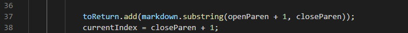

# Lab Report 5 - Week 10

In this lab, we explore some of the problems with `MarkdownParse.java` found during week 9's lab.

In order to find therse problems, first, we took the output of running `MarkdownParse.java` on every test file and put them in a text file. This was done with both our own implementation of MarkdownParse as well as the MarkdownParse implementation provided that week.

All differences were found through the use of bash's `diff` method on the two files.

## The First Test

```
[link](foo
bar)
```

Our current implementation thinks that the entirety of what is in the paranthesis is a link, including the new line character.

The provided implementation thinks that there is no link.

The expected result of this one is no link. That is because it doesn't count as a link if there is a space or a new line character in the middle of the actual link. Thus, the provided implementation is correct.

Since there should be no links returned that have a new line character in it or a space character in it, then the bug must be either that the code isn't checking for new line and space characters, or it is an it is broken. Judging from my `MarkdownParse.java` file, however, the bug seems to be the former.



Above is the buggy line. As shown, it seems that the code is simply taking the substring from the open parenthesis to the close paranthesis without any checking for the validity of what is in the middle. Luckily the fix for this is relatively simple. In the code that adds the potential links to the list of links to return, simply make sure that the link doesn't contain any new line or space characters.

## The Second Test

```
[link [foo [bar]]](/uri)
```

Our current implementation thinks that there is no link.

The provided implementation thinks that there is one link: `/uri`.

The expected output is a singular link, `/uri`, making the provided implementation correct.